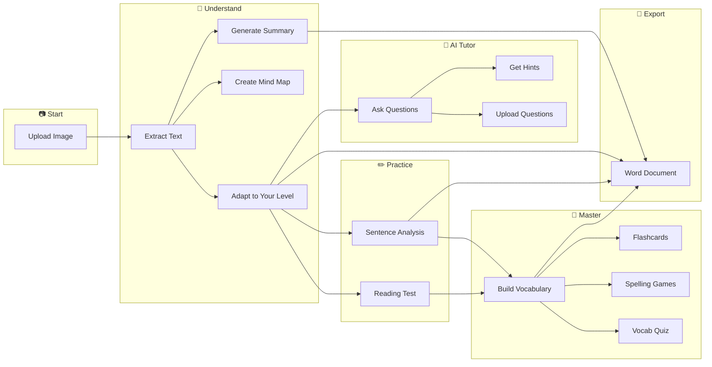

# Mr.🆖 ProReader

### **Your AI-Powered English Reading Tutor**

*Snap. Learn. Master.*

Transform any English reading material into an interactive learning experience with AI-powered comprehension tools, vocabulary games, and personalized practice.

---

## Why Students Love Mr.🆖 ProReader

| **Personalized** | **Gamified** | **Private** |
|:---:|:---:|:---:|
| Adapts to your age & level (8-18) | Learn through fun games & challenges | All data stays in your browser |

---

## Your Learning Journey

---

## Core Features

### 🤖 1. AI Tutor - Your Personal Reading Coach

Got stuck on a passage? The AI Tutor is here to help! This interactive chat assistant understands your reading material and provides personalized guidance.

| Feature | Description |
|---------|-------------|
| 💬 **Natural Conversations** | Ask anything about the text in your own words |
| 🎯 **Context-Aware** | Select any text and ask questions specifically about it |
| 📷 **Image Upload** | Snap a photo of a comprehension question and get help |
| 💡 **Hint Mode** | Get guided hints instead of direct answers (learn, don't cheat!) |
| 📝 **Step-by-Step Explanations** | Understand how to approach reading questions |

#### Quick Question Shortcuts
- **"What's the main idea?"** - Get a quick overview
- **"Vocab help"** - Understand difficult words or phrases
- **"Explain this"** - Get a clear explanation of any passage
- **Upload a question image** - Get guided help solving it

---

### 📷 2. Smart OCR - Snap & Extract

Transform physical reading materials into digital text instantly.

| Feature | Description |
|---------|-------------|
| 📸 **Multi-Image Upload** | Upload multiple pages at once |
| 🖼️ **Format Support** | PNG, JPG, JPEG, WEBP |
| 📊 **Progress Tracking** | Real-time extraction progress |
| 📚 **Any Material** | Textbooks, worksheets, articles, novels |

---

### 📄 3. AI Text Adaptation

Read at YOUR level, not the author's.

| Mode | Description |
|------|-------------|
| 🔄 **Age-Adapted** | AI rewrites text matching your reading level |
| ⬇️ **Simplified** | Even simpler version for challenging passages |
| 📏 **Level Detection** | Auto-detects: Primary 3-6 / Secondary 1-3 / Secondary 4-6 |
| 🔄 **Tab Switching** | Compare original vs. adapted vs. simplified |

---

### 🧠 4. Sentence Analysis

Click any sentence for a complete AI breakdown:

| Analysis Type | What You Learn |
|--------------|----------------|
| 📝 **Meaning** | Summary of what the sentence means |
| 📖 **Vocabulary** | Key words with definitions & examples |
| 🔤 **Syntax** | Grammar structure, clauses, sentence type |
| 💡 **Pragmatics** | Purpose, tone, figures of speech |
| 🎯 **Tips** | How to understand similar sentences |

---

### 🗺️ 5. Visual Learning Tools

| Tool | Purpose |
|------|---------|
| 📋 **Summary** | Quick 2-3 sentence overview |
| 🧩 **Mind Map** | Interactive Mermaid diagram showing key concepts & relationships |
| 🔍 **Zoom & Pan** | Explore mind maps in detail |

---

### ❓ 6. Reading Comprehension Test

Test your understanding with AI-generated questions tailored to YOUR level.

#### Question Types
| Type | Description |
|------|-------------|
| 📌 **Multiple Choice** | Select the best answer |
| ✅ **True/False/Not Given** | Evaluate statements |
| ✍️ **Short Answer** | Type your response (AI-evaluated) |
| 🔮 **Inference** | Read between the lines |
| 📖 **Vocabulary in Context** | Understand words from context |
| 👆 **Pronoun Reference** | Identify what pronouns refer to |

#### Skills Tested
| Skill | Focus |
|-------|-------|
| 🎯 **Main Idea** | Central theme & message |
| 🔍 **Detail** | Specific information |
| 🧩 **Inference** | Logical deductions |
| 📚 **Vocabulary** | Word meanings in context |
| ✍️ **Purpose** | Author's intent |
| 📑 **Sequencing** | Order of events |

#### Test Features
- 📊 **Difficulty Levels**: Foundation → Intermediate → Advanced
- 🔄 **Two Modes**: All-at-once or Question-by-question
- 🏷️ **Paragraph References**: Know which paragraph each question relates to
- 🇨🇳 **Bilingual Support**: Toggle Chinese translations
- 📈 **Skill Breakdown**: See performance by skill after completion
- 🔁 **Retry Missed**: Practice only incorrect answers
- 🎯 **Targeted Practice**: Generate new questions focusing on weak skills

---

### 📖 7. Vocabulary Builder

Build your word power with interactive tools.

#### Step 1: Highlight Words
- 🖍️ Select any word in the text
- ➕ Add to your vocabulary list
- 🔊 Listen to pronunciation

#### Step 2: Generate Glossary
| Field | Content |
|-------|---------|
| 📝 **Word** | The vocabulary word |
| 🏷️ **Part of Speech** | Noun, verb, adjective, etc. |
| 🇬🇧 **English Definition** | Clear English explanation |
| 🇨🇳 **Chinese Definition** | 繁體中文解釋 |
| 💬 **Example Sentence** | Real-world usage context |

#### Step 3: Practice & Master

| Mode | Description |
|------|-------------|
| 📋 **Table View** | Browse all words with definitions |
| 🃏 **Flashcards** | Flip cards to learn, rate difficulty, prioritize hard words |
| 📝 **Vocabulary Quiz** | Test your knowledge |
| 🎮 **Spelling Games** | 4 exciting game modes |

---

### 🎮 8. Spelling Challenge - 4 Game Modes!

| Mode | How It Works | Best For |
|------|--------------|----------|
| 🎧 **Listen & Type** | Hear the word, type what you hear | Auditory learners |
| 🔀 **Letter Scramble** | Unscramble jumbled letters | Visual puzzle lovers |
| ➖ **Fill Blanks** | Type missing letters (shown as _ ) | Pattern recognition |
| 🎲 **Mixed Mode** | Random mix of all modes | Comprehensive practice |

#### Game Features
- ⏱️ **Time Challenge**: Beat the clock for bonus points
- 🔥 **Streak Bonus**: +10% per 3 consecutive correct answers
- 💡 **Hints**: Reveal letters (reduces score)
- 📊 **Difficulty Levels**: Easy / Medium / Hard
- 🏆 **Best Score Tracking**: Beat your personal record
- 🎯 **Prioritize Hard Words**: Focus practice on words you rated as hard

---

### 📋 9. Vocabulary Quiz

Test your vocabulary knowledge with interactive quizzes.

| Question Type | Description |
|---------------|-------------|
| 🔤 **Word-to-Definition** | Match words to their meanings |
| 📖 **Definition-to-Word** | Find the word that matches the definition |
| ✏️ **Fill-in-the-Blank** | Complete sentences with the right word |

#### Quiz Features
- 🔄 **Retry Missed**: Practice only the questions you got wrong
- 🎯 **Prioritize Hard Words**: Focus on words you rated as difficult
- 📊 **Score Tracking**: See your progress over time

---

### 🔊 10. Text-to-Speech

Perfect your pronunciation with natural voice reading.

| Feature | Description |
|---------|-------------|
| 🗣️ **Read Words** | Click any word to hear it |
| 📖 **Read Sentences** | Listen to full sentences |
| 🎙️ **Voice Selection** | Choose your preferred voice |
| 🔄 **Auto-Speak** | Flashcards can auto-read on load |

---

### 📄 11. Word Export

Download your learning materials for offline study.

| Export Type | Description |
|-------------|-------------|
| 📝 **Text Analysis & Adaptation** | Original, adapted, simplified text with optional glossary & sentence analysis |
| 📖 **Glossary** | Bilingual word definitions table with examples |
| 📋 **Vocabulary Quiz** | Quiz questions (blank or with answer key) |
| ❓ **Reading Test** | Comprehension questions (blank or with answer key) |
| 🖨️ **Print Ready** | All exports formatted for printing |

---

## Data & Privacy

| Feature | Details |
|---------|---------|
| 💾 **Local Storage** | All data stored in your browser only |
| 📤 **Export Sessions** | Download as JSON for backup |
| 📥 **Import Sessions** | Restore previous sessions |
| 📚 **History** | Automatic session tracking |
| 🗑️ **Delete Anytime** | Full control over your data |

---

## AI Models Supported

| Provider | Models |
|----------|--------|
| 🟢 **Google Gemini** | gemini-3-flash-preview |
| 🔵 **OpenAI** | gpt-5-mini, gpt-4.1-mini |
| 🟠 **DeepSeek** | deepseek-chat |
| ⚡ **zAI** | glm-4.7 |

### Access Modes
| Mode | Description |
|------|-------------|
| 💰 **Paid Mode** | Use your own API key, pay per usage |
| 🎓 **EDU Mode** | Free access provided by Mr.🆖 (password required) |

---

## Languages

| Language | Code |
|----------|------|
| 🇬🇧 English | en-US |
| 🇭🇰 繁體中文 | zh-HK |

---

## Tech Stack

| Category | Technology |
|----------|------------|
| ⚡ **Framework** | Next.js 15 (App Router) |
| 🎨 **UI** | Shadcn UI + Tailwind CSS |
| 📦 **State** | Zustand (with persistence) |
| 🤖 **AI** | Vercel AI SDK |
| 🎭 **Icons** | Lucide React |
| 📊 **Diagrams** | Mermaid |
| 🌍 **i18n** | react-i18next |

---

## License

[MIT License](LICENSE) - Free for personal and commercial use.

---

### Built with ❤️ by Mr.🆖 for students learning English

**Start your reading adventure today! 🚀**

