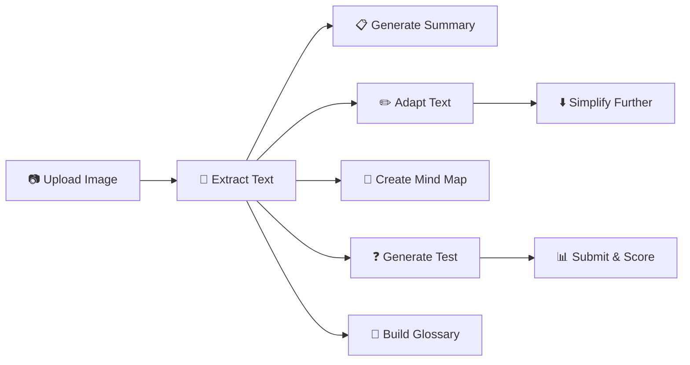

<div align="center">

# 📚 Mr.🆖 English Reading Assistant

**AI-Powered Reading Companion for Students**


</div>

---

## 🎯 Objectives

**Mr.🆖 English Reading Assistant** is designed to help students master English reading through personalized, AI-powered learning experiences. The app adapts to each student's age and reading level, making English comprehension accessible and engaging.

### Core Goals
- 🎓 **Personalized Learning** - Content adapted to student's age (8-18 years old)
- 📖 **Reading Comprehension** - Build understanding through summaries, mind maps, and tests
- 📝 **Vocabulary Building** - Interactive glossary with bilingual definitions
- 🔊 **Text-to-Speech** - Listen to words and passages for better pronunciation
- 🔒 **Privacy First** - All data stored locally in the browser

---

## ✨ Features

### 📷 Image to Text (OCR)
- Upload images of English reading materials
- Supports PNG, JPG, JPEG, WEBP formats
- Multi-image processing with progress tracking
- Extract text from textbooks, worksheets, or any reading material

### 📄 Smart Text Adaptation
- **Age-Appropriate Adaptation** - Rewrites text to match student's reading level
- **Simplification** - Further simplifies complex passages
- **Level Estimation** - Automatically estimates reading level (Primary 3-6, Secondary 1-3, Secondary 4-6)

### 🧠 Visual Learning Tools
- **Summary Generation** - Quick overview of the main content
- **Mind Map** - Visual representation of key concepts and relationships
- **Mermaid Diagrams** - Interactive, zoomable mind maps

### ✏️ Interactive Assessment
- **Reading Tests** - Auto-generated comprehension questions
- **Multiple Question Types**:
  - 📌 Multiple Choice
  - ✅ True/False
  - ✍️ Short Answer
- **Instant Scoring** - Immediate feedback with explanations
- **Retry Support** - Practice until mastery

### 📖 Vocabulary Builder
- **Word Highlighting** - Select words to add to vocabulary list
- **Bilingual Glossary** - English definitions with Chinese translations
- **Context Examples** - Example sentences for each word
- **CSV Export** - Download vocabulary for offline study

### 🗣️ Text-to-Speech
- **Read Aloud** - Listen to highlighted words or passages
- **Voice Selection** - Choose from available TTS voices
- **Pronunciation Practice** - Improve speaking skills

---

## 🔄 Workflow



### Step-by-Step Process
1. **📸 Upload** - Take or upload photos of reading materials
2. **📝 Extract** - AI extracts text from images via OCR
3. **📋 Summarize** - Get a quick summary of the content
4. **✏️ Adapt** - Text is rewritten for the student's level
5. **🧠 Visualize** - Generate an interactive mind map
6. **❓ Test** - Take a comprehension quiz
7. **📖 Learn** - Build vocabulary from highlighted words

---

## 🤖 Supported AI Models

The app works with various AI providers:

| Provider | Description |
|----------|-------------|
| 🟢 **Google Gemini** | Free tier available (recommended) |
| 🔵 **OpenAI** | GPT-4, GPT-3.5 models |
| 🟣 **Anthropic** | Claude models |
| 🟠 **DeepSeek** | Cost-effective option |
| ⚡ **XAI** | Grok models |
| 🌊 **Mistral** | Open-weight models |
| ☁️ **Azure OpenAI** | Enterprise Azure deployment |
| 🔀 **OpenRouter** | Multi-model gateway |
| 🦙 **Ollama** | Local model support |

### API Modes
- **💰 Paid Mode** - Use your own API key, pay for your usage
- **🎓 EDU Mode** - Free access provided by Mr.🆖 (password required)

---

## 🚀 Getting Started

### Prerequisites
- Node.js 18.18.0+
- pnpm / npm / yarn

### Installation

```bash
# Clone the repository
git clone https://github.com/u14app/deep-research.git
cd deep-research

# Install dependencies
pnpm install

# Set up environment
cp env.tpl .env.local

# Run development server
pnpm dev
```

Open [http://localhost:3000](http://localhost:3000) to use the app.

### Quick Start with Gemini (Free)

1. Get your [Gemini API Key](https://aistudio.google.com/app/apikey)
2. Deploy to Vercel or Cloudflare
3. Enter your API key in settings
4. Start learning!

---

## 🚢 Deployment

### Vercel (Recommended)

[](https://vercel.com/new/clone?repository-url=https%3A%2F%2Fgithub.com%2Fu14app%2Fdeep-research&project-name=deep-research&repository-name=deep-research)

### Cloudflare Pages

See [How to deploy to Cloudflare Pages](./docs/How-to-deploy-to-Cloudflare-Pages.md)

### Docker

```bash
docker pull xiangfa/deep-research:latest
docker run -d --name reading-assistant -p 3333:3000 xiangfa/deep-research
```

With environment variables:
```bash
docker run -d --name reading-assistant \
   -p 3333:3000 \
   -e ACCESS_PASSWORD=your-password \
   -e GOOGLE_GENERATIVE_AI_API_KEY=AIzaSy... \
   xiangfa/deep-research
```

---

## 💾 Data & Privacy

### Local Storage
- ✅ All reading sessions stored locally in browser
- ✅ No data sent to external servers (in local mode)
- ✅ Export/Import sessions for backup

### History Management
- 📚 Automatic session history
- 📥 Export sessions as JSON
- 📤 Import previous sessions
- 🗑️ Delete individual or all history

---

## ⚙️ Configuration

Key environment variables (see `env.tpl` for complete list):

| Variable | Description |
|----------|-------------|
| `ACCESS_PASSWORD` | Password for EDU mode access |
| `GOOGLE_GENERATIVE_AI_API_KEY` | Gemini API key |
| `OPENAI_API_KEY` | OpenAI API key |
| `ANTHROPIC_API_KEY` | Claude API key |
| `DEEPSEEK_API_KEY` | DeepSeek API key |

---

## 🌐 Multi-Language Support

| Language | Code |
|----------|------|
| English | en-US |
| 繁體中文 | zh-HK |

---

## 🛠️ Tech Stack

- **Framework**: Next.js 15 (App Router)
- **UI Components**: Shadcn UI
- **Styling**: Tailwind CSS
- **State Management**: Zustand
- **AI Integration**: Vercel AI SDK
- **Icons**: Lucide React
- **Diagrams**: Mermaid
- **i18n**: react-i18next

---

## 🙏 Acknowledgements

- [Next.js](https://nextjs.org/) - React framework
- [Shadcn UI](https://ui.shadcn.com/) - Beautiful components
- [Vercel AI SDK](https://sdk.vercel.ai) - AI integration
- [Mermaid](https://mermaid.js.org/) - Diagram generation

---

## 📝 License

[MIT License](LICENSE) - Free for personal and commercial use.

---

<div align="center">

**Built with ❤️ for students learning English**

[🐛 Report Bug](https://github.com/u14app/deep-research/issues) · [💡 Request Feature](https://github.com/u14app/deep-research/issues)

</div>
