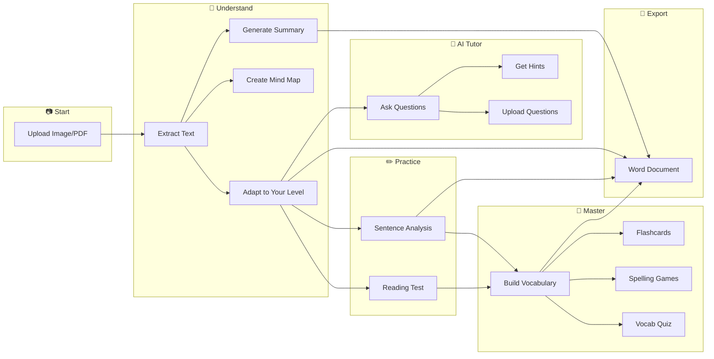

<div align="center">

# Mr.🆖 ProReader

### **Your AI-Powered English Reading Tutor**

*Snap. Learn. Master.*

Transform any English reading material into an interactive learning experience with AI-powered comprehension tools, vocabulary games, and personalized practice.


[Live Demo](https://read.mr5ai.com) · [Report Bug](https://github.com/u14app/reading-assistant/issues) · [Request Feature](https://github.com/u14app/reading-assistant/issues)

</div>

---

## Why Students & Teachers Love Mr.🆖 ProReader

| **Personalized** | **Gamified** | **Cloud Sync** | **Collaborative** |
|:---:|:---:|:---:|:---:|
| Adapts to your age & level (8-18) | Learn through games & achievements | Your progress syncs automatically—access your data from any device with every sign-in | Share texts with classes & schools |

---

## Your Learning Journey


```mermaid
flowchart LR
    subgraph INPUT["📷 Start"]
        A[Upload Image/PDF]
    end
    
    subgraph UNDERSTAND["🧠 Understand"]
        B[Extract Text]
        C[Generate Summary]
        D[Create Mind Map]
        E[Adapt to Your Level]
    end
    
    subgraph TUTOR["🤖 AI Tutor"]
        M[Ask Questions]
        N[Get Hints]
        O[Upload Questions]
    end
    
    subgraph PRACTICE["✏️ Practice"]
        F[Reading Test]
        G[Sentence Analysis]
    end
    
    subgraph MASTER["📖 Master"]
        H[Build Vocabulary]
        I[Flashcards]
        J[Spelling Games]
        K[Vocab Quiz]
    end
    
    subgraph EXPORT["📄 Export"]
        L[Word Document]
    end
    
    A --> B
    B --> C & D & E
    E --> F & G & M
    M --> N & O
    G --> H
    F --> H
    H --> I & J & K
    C & E & G & H --> L
```

---

## Core Features

### 📊 1. Text Difficulty Analyzer

**Know your text before you read.** Get a comprehensive analysis of any reading material's complexity with scientific readability metrics.

| Metric | What It Tells You |
|--------|-------------------|
| 🎯 **CEFR Level** | Overall difficulty (A1-Beginner → C2-Mastery) |
| 📖 **Flesch Reading Ease** | How easy the text is to read (0-100 scale) |
| 📚 **Grade Level** | U.S. school grade equivalent |
| 📏 **Sentence Length** | Average words per sentence |
| 🔢 **Word Stats** | Total words, sentences, syllables |

#### Multi-Formula Analysis
The analyzer uses **5 scientific readability formulas** for accuracy:

| Formula | Best For |
|---------|----------|
| **Flesch-Kincaid** | General readability |
| **Automated Readability (ARI)** | Technical documents |
| **Coleman-Liau** | Academic texts |
| **SMOG** | Health & safety materials |
| **CEFR Complexity** | Language learners |

#### Compare Versions Side-by-Side
Analyze original, adapted, and simplified versions simultaneously to see exactly how AI simplification affects readability.

---

### 🎨 2. CEFR Word Highlight

**See vocabulary difficulty at a glance.** Every word is color-coded by its CEFR level, making it easy to identify challenging vocabulary instantly.

| Level | Description | Color |
|-------|-------------|-------|
| **A1** | Beginner | 🔵 Cyan |
| **A2** | Elementary | 🟢 Green |
| **B1** | Intermediate | 🟡 Amber |
| **B2** | Upper-Intermediate | 🟠 Orange |
| **C1** | Advanced | 🔴 Red |
| **C2** | Mastery | 🟣 Purple |

#### Interactive Features
- **Toggle Levels On/Off**: Focus on specific difficulty levels
- **Word Count Per Level**: See exactly how many words exist at each CEFR level
- **Hover Tooltips**: Hover any highlighted word to see its CEFR level
- **Three Text Versions**: Highlight original, adapted, or simplified text

---

### 🤖 3. AI Tutor - Your Personal Reading Coach

Got stuck on a passage? The AI Tutor is here to help! This interactive chat assistant understands your reading material and provides personalized guidance.

| Feature | Description |
|---------|-------------|
| 💬 **Natural Conversations** | Ask anything about the text in your own words |
| 🎯 **Context-Aware** | Select any text and ask questions specifically about it |
| 📷 **Image Upload** | Snap a photo of a comprehension question and get help |
| 💡 **Hint Mode** | Get guided hints instead of direct answers (learn, don't cheat!) |
| 📝 **Step-by-Step Explanations** | Understand how to approach reading questions |

---

### 📷 4. Smart OCR - Snap & Extract

Transform physical reading materials into digital text instantly.

| Feature | Description |
|---------|-------------|
| 📸 **Multi-Image Upload** | Upload multiple pages at once |
| 🖼️ **Format Support** | PNG, JPG, JPEG, WEBP, PDF |
| 📊 **Progress Tracking** | Real-time extraction progress |
| 📚 **Any Material** | Textbooks, worksheets, articles, novels |

---

### 📄 5. AI Text Adaptation

Read at YOUR level, not the author's.

| Mode | Description |
|------|-------------|
| 🔄 **Age-Adapted** | AI rewrites text matching your reading level |
| ⬇️ **Simplified** | Even simpler version for challenging passages |
| 📏 **Level Detection** | Auto-detects: Primary 3-6 / Secondary 1-3 / Secondary 4-6 |
| 🔄 **Tab Switching** | Compare original vs. adapted vs. simplified |

---

### 🧠 6. Sentence Analysis

Click any sentence for a complete AI breakdown:

| Analysis Type | What You Learn |
|--------------|----------------|
| 📝 **Meaning** | Summary of what the sentence means |
| 📖 **Vocabulary** | Key words with definitions & examples |
| 🔤 **Syntax** | Grammar structure, clauses, sentence type |
| 💡 **Pragmatics** | Purpose, tone, figures of speech |
| 🎯 **Tips** | How to understand similar sentences |

---

### 🗺️ 7. Visual Learning Tools

| Tool | Purpose |
|------|---------|
| 📋 **Summary** | Quick 2-3 sentence overview |
| 🧩 **Mind Map** | Interactive Mermaid diagram showing key concepts & relationships |
| 🔍 **Zoom & Pan** | Explore mind maps in detail |

---

### ❓ 8. Reading Comprehension Test

Test your understanding with AI-generated questions tailored to YOUR level.

#### Question Types
| Type | Description |
|------|-------------|
| 📌 **Multiple Choice** | Select the best answer |
| ✅ **True/False/Not Given** | Evaluate statements |
| ✍️ **Short Answer** | Type your response (AI-evaluated) |
| 🔮 **Inference** | Read between the lines |
| 📖 **Vocabulary in Context** | Understand words from context |
| 👆 **Pronoun Reference** | Identify what pronouns refer to |

#### Skills Tested
| Skill | Focus |
|-------|-------|
| 🎯 **Main Idea** | Central theme & message |
| 🔍 **Detail** | Specific information |
| 🧩 **Inference** | Logical deductions |
| 📚 **Vocabulary** | Word meanings in context |
| ✍️ **Purpose** | Author's intent |

#### Test Features
- 📊 **Difficulty Levels**: Foundation → Intermediate → Advanced
- 🔄 **Two Modes**: All-at-once or Question-by-question
- 🏷️ **Paragraph References**: Know which paragraph each question relates to
- 🇨🇳 **Bilingual Support**: Toggle Chinese translations
- 📈 **Skill Breakdown**: See performance by skill after completion
- 🔁 **Retry Missed**: Practice only incorrect answers
- 🎯 **Targeted Practice**: Generate new questions focusing on weak skills

---

### 📖 9. Vocabulary Builder

Build your word power with interactive tools.

#### Step 1: Highlight Words
- 🖍️ Select any word in the text
- ➕ Add to your vocabulary list
- 🔊 Listen to pronunciation

#### Step 2: Generate Glossary
| Field | Content |
|-------|---------|
| 📝 **Word** | The vocabulary word |
| 🏷️ **Part of Speech** | Noun, verb, adjective, etc. |
| 🇬🇧 **English Definition** | Clear English explanation |
| 🇨🇳 **Chinese Definition** | 繁體中文解釋 |
| 💬 **Example Sentence** | Real-world usage context |

#### Step 3: Practice & Master

| Mode | Description |
|------|-------------|
| 📋 **Table View** | Browse all words with definitions |
| 🃏 **Flashcards** | Flip cards to learn, rate difficulty, prioritize hard words |
| 📝 **Vocabulary Quiz** | Test your knowledge |
| 🎮 **Spelling Games** | 4 exciting game modes |

---

### 🎮 10. Spelling Challenge - 4 Game Modes!

| Mode | How It Works | Best For |
|------|--------------|----------|
| 🎧 **Listen & Type** | Hear the word, type what you hear | Auditory learners |
| 🔀 **Letter Scramble** | Unscramble jumbled letters | Visual puzzle lovers |
| ➖ **Fill Blanks** | Type missing letters (shown as _ ) | Pattern recognition |
| 🎲 **Mixed Mode** | Random mix of all modes | Comprehensive practice |

#### Game Features
- ⏱️ **Time Challenge**: Beat the clock for bonus points
- 🔥 **Streak Bonus**: +10% per 3 consecutive correct answers
- 💡 **Hints**: Reveal letters (reduces score)
- 📊 **Difficulty Levels**: Easy / Medium / Hard
- 🏆 **Best Score Tracking**: Beat your personal record
- 🎯 **Prioritize Hard Words**: Focus practice on words you rated as hard

---

### 📋 11. Vocabulary Quiz

Test your vocabulary knowledge with interactive quizzes.

| Question Type | Description |
|---------------|-------------|
| 🔤 **Word-to-Definition** | Match words to their meanings |
| 📖 **Definition-to-Word** | Find the word that matches the definition |
| ✏️ **Fill-in-the-Blank** | Complete sentences with the right word |

---

### 🔊 12. Text-to-Speech

Perfect your pronunciation with natural voice reading.

| Feature | Description |
|---------|-------------|
| 🗣️ **Read Words** | Click any word to hear it |
| 📖 **Read Sentences** | Listen to full sentences |
| 🎙️ **Voice Selection** | Choose your preferred voice |
| 🔄 **Auto-Speak** | Flashcards can auto-read on load |

---

### 📄 13. Word Export

Download your learning materials for offline study.

| Export Type | Description |
|-------------|-------------|
| 📝 **Text Analysis & Adaptation** | Original, adapted, simplified text with optional glossary & sentence analysis |
| 📖 **Glossary** | Bilingual word definitions table with examples |
| 📋 **Vocabulary Quiz** | Quiz questions (blank or with answer key) |
| ❓ **Reading Test** | Comprehension questions (blank or with answer key) |
| 🖨️ **Print Ready** | All exports formatted for printing |

---

## 🆕 New Features

### 🏆 14. Leaderboard & Achievements

Compete with classmates and track your learning journey!

#### Weekly Leaderboard
| Feature | Description |
|---------|-------------|
| 📊 **Class Rankings** | See where you stand among classmates |
| 🔥 **Reading Streaks** | Track consecutive days of reading |
| 📈 **Weekly Score** | Points for sessions, tests, quizzes, and games |
| ⬆️ **Improvement Indicator** | See your progress compared to last week |

#### Personal Statistics
| Stat | What It Shows |
|------|---------------|
| 📚 **Total Sessions** | Reading materials completed |
| 📝 **Tests Completed** | Comprehension tests taken |
| 🎯 **Average Test Score** | Your overall performance |
| 🃏 **Flashcard Reviews** | Vocabulary cards reviewed |
| 🎮 **Spelling Games** | Games played |
| 📖 **Vocabulary Words** | Words in your collection |

#### Achievement System
Unlock medals by reaching learning milestones:

| Achievement Type | Milestones |
|-----------------|------------|
| 📚 **Sessions Read** | 1, 5, 10, 25, 50, 100 sessions |
| 📖 **Vocabulary Collected** | 10, 50, 100, 250, 500 words |
| 🃏 **Flashcard Reviews** | 50, 200, 500, 1000 reviews |
| 📝 **Tests Completed** | 5, 15, 30, 50 tests |
| 🎮 **Spelling Challenges** | 10, 30, 50, 100 games |
| 📋 **Quizzes Completed** | 5, 15, 30, 50 quizzes |

---

### 📚 15. Text Repository

Share and reuse reading materials across your school or class.

| Feature | Description |
|---------|-------------|
| 📤 **Upload Texts** | Save reading materials for future use |
| 🏫 **School Sharing** | Share texts with your entire school |
| 👥 **Class Sharing** | Share texts with specific classes |
| 🌍 **Public Library** | Access publicly shared materials |
| 🔍 **Search & Filter** | Find texts by name, date, or visibility |
| 📥 **Import/Export** | Backup and restore text collections |

---

### 🏫 16. School & Class Management

Built for educational institutions with multi-tenant support.

#### For Teachers
| Feature | Description |
|---------|-------------|
| 👨‍🏫 **Class Creation** | Create and manage classes |
| 👥 **Student Management** | Add/remove students from classes |
| 📊 **Progress Monitoring** | Track student activity and scores |
| 📚 **Shared Materials** | Distribute reading texts to classes |

#### For Administrators
| Feature | Description |
|---------|-------------|
| 🏫 **School Management** | Create and configure schools |
| 👥 **User Management** | Manage teachers and students |
| 📊 **Data Export** | Export data for analysis |
| 🔐 **Access Control** | Manage roles and permissions |

---

### 🔐 17. Authentication & Security

Secure login with Google OAuth integration.

| Feature | Description |
|---------|-------------|
| 🔑 **Google Sign-In** | One-click login with Google |
| 👤 **Role-Based Access** | Student, Teacher, Admin roles |
| 🏫 **School Scoping** | Data isolated by school |
| 🔒 **Secure Sessions** | Auth.js powered authentication |

---

### 📱 18. PWA Support

Install Mr.🆖 ProReader as a native app on your device!

| Feature | Description |
|---------|-------------|
| 📲 **Installable** | Add to home screen on mobile/desktop |
| 🔄 **Offline Ready** | Works without internet connection |
| 🚀 **Fast Loading** | Cached assets for instant startup |
| 📱 **Native Feel** | Full-screen, app-like experience |

---

## AI Models Supported

| Provider | Models |
|----------|--------|
| 🟢 **Google Gemini** | gemini-3-flash |
| 🔵 **OpenAI** | gpt-5.1, gpt-5-mini, gpt-5-nano |
| 🟣 **DeepSeek** | deepseek-chat |

### Access Modes
| Mode | Description |
|------|-------------|
| 💰 **Paid Mode** | Use your own API keys, pay per usage |
| 🎓 **EDU Mode** | Free access provided by Mr.🆖 (password required) |

---

## Languages

| Language | Code | Status |
|----------|------|--------|
| 🇬🇧 English | en-US | ✅ Full Support |
| 🇭🇰 繁體中文 | zh-HK | ✅ Full Support |

---

## Tech Stack

| Category | Technology |
|----------|------------|
| ⚡ **Framework** | Next.js 15 (App Router) |
| ⚛️ **UI Library** | React 19 |
| 🔷 **Language** | TypeScript |
| 🎨 **Styling** | Tailwind CSS + Shadcn UI |
| 📦 **State** | Zustand (with persistence) |
| 🗄️ **Database** | PostgreSQL |
| 🔐 **Auth** | Auth.js (NextAuth v5) |
| 🤖 **AI** | Vercel AI SDK |
| 🎭 **Icons** | Lucide React |
| 📊 **Diagrams** | Mermaid |
| 📝 **Markdown** | react-markdown + KaTeX |
| 🌍 **i18n** | react-i18next |

---

## Project Structure

```
src/
├── app/                    # Next.js App Router
│   ├── api/               # API routes (AI, auth, admin)
│   ├── leaderboard/       # Leaderboard page
│   └── page.tsx           # Main application
├── components/
│   ├── ui/                # Shadcn UI primitives
│   ├── Internal/          # Shared components
│   ├── ReadingAssistant/  # Core feature components
│   ├── Leaderboard/       # Leaderboard & achievements
│   └── Provider/          # Context providers
├── hooks/                 # Custom React hooks
├── store/                 # Zustand state stores
├── utils/                 # Helper functions
├── constants/             # App constants
├── locales/               # i18n translations
└── types.d.ts            # TypeScript interfaces
```

---

## License

[MIT License](LICENSE) - Free for personal use.

---

## Acknowledgments

- [Shadcn UI](https://ui.shadcn.com/) for beautiful components
- [Vercel AI SDK](https://sdk.vercel.ai/) for AI integration
- [Mermaid](https://mermaid.js.org/) for mind maps
- All the amazing open-source libraries that make this possible

---

<div align="center">

### Built with ❤️ by Mr.🆖 for students learning English

**Start your reading adventure today! 🚀**

[Get Started](https://read.mr5ai.com) · [AI API Provider](https://api.mr5ai.com)

</div>
