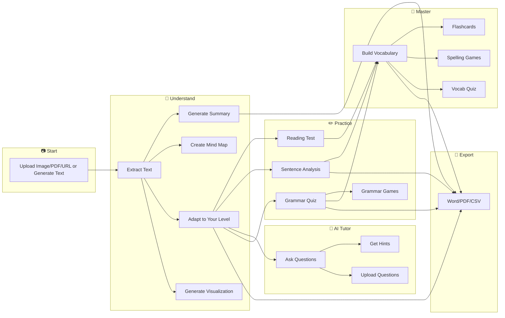

<div align="center">

# Mr.🆖 ProReader

### **Your AI-Powered English Reading Tutor**

*Snap. Learn. Master.*

Transform any English reading material into an interactive learning experience with AI-powered comprehension tools, vocabulary games, and personalized practice.


[Live Demo](https://read.mr5ai.com)

</div>

---

## Why Students & Teachers Love Mr.🆖 ProReader

| **Personalized** | **Gamified** | **Data Insights** | **Collaborative** |
|:---:|:---:|:---:|:---:|
| Adapts to your age & level (8-18) | 5 grammar games + spelling & vocab challenges | Rich dashboards & charts visualize progress, readability, and vocabulary mastery | Share sessions, assignments, vocab lists & texts |

---

## Your Learning Journey


```mermaid
flowchart LR
    subgraph INPUT["📷 Start"]
        A[Upload Image/PDF/URL or Generate Text]
    end
    
    subgraph UNDERSTAND["🧠 Understand"]
        B[Extract Text]
        C[Generate Summary]
        D[Create Mind Map]
        E[Adapt to Your Level]
        Q[Generate Visualization]
    end
    
    subgraph TUTOR["🤖 AI Tutor"]
        M[Ask Questions]
        N[Get Hints]
        O[Upload Questions]
    end
    
    subgraph PRACTICE["✏️ Practice"]
        F[Reading Test]
        G[Sentence Analysis]
        P[Grammar Quiz]
        R[Grammar Games]
    end
    
    subgraph MASTER["📖 Master"]
        H[Build Vocabulary]
        I[Flashcards]
        J[Spelling Games]
        K[Vocab Quiz]
    end
    
    subgraph EXPORT["📄 Export"]
        L[Word/PDF/CSV]
    end
    
    A --> B
    B --> C & D & E & Q
    E --> F & G & M & P
    P --> R
    M --> N & O
    G --> H
    F --> H
    P --> H
    H --> I & J & K
    C & E & G & H & P --> L
```

---

## Core Features

### 📊 1. Text Difficulty Analyzer

**Know your text before you read.** Get a comprehensive analysis of any reading material's complexity with scientific readability metrics.

| Metric | What It Tells You |
|--------|-------------------|
| 🎯 **CEFR Level** | Overall difficulty (A1-Beginner → C2-Mastery) |
| 📖 **Flesch Reading Ease** | How easy the text is to read (0-100 scale) |
| 📚 **Grade Level** | U.S. school grade equivalent |
| 📏 **Sentence Length** | Average words per sentence |
| 🔢 **Word Stats** | Total words, sentences, syllables |

#### Multi-Formula Analysis
The analyzer uses **5 scientific readability formulas** for accuracy:

| Formula | Best For |
|---------|----------|
| **Flesch-Kincaid** | General readability |
| **Automated Readability (ARI)** | Technical documents |
| **Coleman-Liau** | Academic texts |
| **SMOG** | Health & safety materials |
| **CEFR Complexity** | Language learners |

#### Compare Versions Side-by-Side
Analyze original, adapted, and simplified versions simultaneously to see exactly how AI simplification affects readability.

---

### 🎨 2. CEFR Word Highlight

**See vocabulary difficulty at a glance.** Every word is color-coded by its CEFR level, making it easy to identify challenging vocabulary instantly.

| Level | Description | Color |
|-------|-------------|-------|
| **A1** | Beginner | 🔵 Cyan |
| **A2** | Elementary | 🟢 Green |
| **B1** | Intermediate | 🟡 Amber |
| **B2** | Upper-Intermediate | 🟠 Orange |
| **C1** | Advanced | 🔴 Red |
| **C2** | Mastery | 🟣 Purple |

#### Interactive Features
- **Toggle Levels On/Off**: Focus on specific difficulty levels
- **Word Count Per Level**: See exactly how many words exist at each CEFR level
- **Hover Tooltips**: Hover any highlighted word to see its CEFR level
- **Three Text Versions**: Highlight original, adapted, or simplified text

---

### 🤖 3. AI Tutor - Your Personal Reading Coach

Got stuck on a passage? The AI Tutor is here to help! This interactive chat assistant understands your reading material and provides personalized guidance.

| Feature | Description |
|---------|-------------|
| 💬 **Natural Conversations** | Ask anything about the text in your own words |
| 🎯 **Context-Aware** | Select any text and ask questions specifically about it |
| 📷 **Image Upload** | Snap a photo of a comprehension question and get help |
| 💡 **Hint Mode** | Get guided hints instead of direct answers (learn, don't cheat!) |
| 📝 **Step-by-Step Explanations** | Understand how to approach reading questions |

#### 🧭 Learning Recommendation Engine
After each reading session, an adaptive dialog analyzes your progress across all activities — reading tests, grammar quizzes, vocabulary reviews, spelling games, and more — and suggests the most impactful next step. Recommendations are personalized based on incomplete activities, past performance, and session context. One click takes you straight to the recommended activity.

---

### 📷 4. Smart OCR - Snap & Extract

Transform physical reading materials into digital text instantly.

| Feature | Description |
|---------|-------------|
| 📸 **Multi-Image Upload** | Upload multiple pages at once |
| 🖼️ **Format Support** | PNG, JPG, JPEG, WEBP, PDF |
| 📊 **Progress Tracking** | Real-time extraction progress |
| 📚 **Any Material** | Textbooks, worksheets, articles, novels |

---

### ✨ 5. AI Text Generator

No reading material on hand? Generate one instantly. Type a topic, pick a text type and length, and AI writes an age-appropriate reading passage at the right CEFR level.

| Feature | Description |
|---------|-------------|
| 🎯 **Topic-Based** | Enter any subject and AI writes a passage about it |
| 📏 **Length & Level Control** | Choose text type, length, and target difficulty |
| 📊 **Built-in Difficulty Check** | Generated text is analyzed for CEFR level on the spot |
| 🔁 **Regenerate** | One tap to make the text easier or harder |

---

### 📄 6. AI Text Adaptation

Read at YOUR level, not the author's.

| Mode | Description |
|------|-------------|
| 🔄 **Age-Adapted** | AI rewrites text matching your reading level |
| ⬇️ **Simplified** | Even simpler version for challenging passages |
| 📏 **Level Detection** | Auto-detects: Primary 3-6 / Secondary 1-3 / Secondary 4-6 |
| 🔄 **Tab Switching** | Compare original vs. adapted vs. simplified |

---

### 🧠 7. Sentence Analysis

Click any sentence for a complete AI breakdown:

| Analysis Type | What You Learn |
|--------------|----------------|
| 📝 **Meaning** | Summary of what the sentence means |
| 📖 **Vocabulary** | Key words with definitions & examples |
| 🔤 **Syntax** | Grammar structure, clauses, sentence type |
| 💡 **Pragmatics** | Purpose, tone, figures of speech |
| 🎯 **Tips** | How to understand similar sentences |

---

### 🗺️ 8. Visual Learning Tools

| Tool | Purpose |
|------|---------|
| 📋 **Summary** | Quick 2-3 sentence overview |
| 🧩 **Mind Map** | Interactive Mermaid diagram showing key concepts & relationships |
| 🎨 **AI Visualization** | AI-generated illustration of the text content (downloadable as PNG) |
| 🔍 **Zoom & Pan** | Explore mind maps in detail |

---

### 📐 9. Grammar Analysis & Quiz

Learn grammar structures found directly in your reading material. AI identifies, explains, and tests your understanding of real-world grammar usage.

#### Grammar Topics Analysis
AI scans your text and identifies notable grammar structures appropriate for your age and level (4/6/8 topics for primary/secondary/DSE). Each topic includes:

| Field | Content |
|-------|---------|
| 🏷️ **Category** | One of 14 categories (tenses, conditionals, passive voice, relative clauses, etc.) |
| 📊 **CEFR Level** | A1–C2 difficulty rating |
| 📝 **Bilingual Explanation** | English + Traditional Chinese |
| 🧩 **Pattern** | Grammar formula (e.g., "Subject + has/have + Past Participle") |
| 💬 **Examples** | Sentences from the text and AI-generated examples |
| ⚠️ **Common Mistakes** | Errors students typically make (bilingual) |
| 📍 **Text Sentences** | Exact quotes from the reading showing the grammar in use |

#### Interactive Grammar Lessons
Each identified topic has a dedicated lesson view with detailed explanations, patterns, text-based examples, and common mistakes — all bilingual (English + 繁體中文).

#### Grammar Quiz
Test your understanding with a 10-question interactive quiz:

| Question Type | Format | Scoring |
|---------------|--------|---------|
| 🔍 **Identify** | Multiple choice: which grammar structure is used? | 1 point |
| ✏️ **Fill-in** | Type the correct grammar form | 2 points (AI-evaluated) |
| 🐛 **Error Spot** | Multiple choice: find and correct the error | 1 point |
| 🔄 **Rewrite** | Rewrite using a different grammar structure | 2 points (AI-evaluated with partial credit) |

#### Grammar Text Highlighting
- 🎨 **Color-coded** grammar structure sentences highlighted directly in the original text
- 🔘 **Toggle per topic**: Show/hide highlights for each grammar topic individually
- 📊 **14 distinct categories** with unique color schemes

#### Grammar Games (5 Gamified Exercises)
Practice grammar through fun, interactive games — all generated from your reading material's grammar topics.

| Game | Description |
|------|-------------|
| 🎡 **Grammar Roulette** | Spinning wheel selects a grammar topic; answer MCQs to score |
| 🏥 **Error Surgery** | Identify and fix the grammar error in AI-generated sentences |
| 🔧 **Grammar Workshop** | Fill-in-the-blank with draggable word bank challenges |
| ⚔️ **Grammar Duel** | Turn-based battle vs AI — earn power moves after streaks |
| 🔀 **Word Scramble** | Reorder scrambled words into grammatically correct sentences |

**Game Modes:**
| Mode | Description |
|------|-------------|
| 🎯 **Practice** | No timer, learn at your pace |
| 🏃 **Arcade** | Beat the clock for bonus points |
| 🏆 **Mastery** | Reach a target score to win |

All games feature celebration animations (canvas-confetti), performance tiers (Master/Great/Good), and persistent high scores.

---

### ❓ 10. Reading Comprehension Test

Test your understanding with AI-generated questions tailored to YOUR level.

#### Question Types
| Type | Description |
|------|-------------|
| 📌 **Multiple Choice** | Select the best answer |
| ✅ **True/False/Not Given** | Evaluate statements |
| ✍️ **Short Answer** | Type your response (AI-evaluated) |
| 🔮 **Inference** | Read between the lines |
| 📖 **Vocabulary in Context** | Understand words from context |
| 👆 **Pronoun Reference** | Identify what pronouns refer to |

#### Skills Tested
| Skill | Focus |
|-------|-------|
| 🎯 **Main Idea** | Central theme & message |
| 🔍 **Detail** | Specific information |
| 🧩 **Inference** | Logical deductions |
| 📚 **Vocabulary** | Word meanings in context |
| ✍️ **Purpose** | Author's intent |

#### Test Features
- 📊 **Difficulty Levels**: Foundation → Intermediate → Advanced
- 🔄 **Two Modes**: All-at-once or Question-by-question
- 🏷️ **Paragraph References**: Know which paragraph each question relates to
- 🇨🇳 **Bilingual Support**: Toggle Chinese translations
- 📈 **Skill Breakdown**: See performance by skill after completion
- 🔁 **Retry Missed**: Practice only incorrect answers
- 🎯 **Targeted Practice**: Generate new questions focusing on weak skills

---

### 📖 11. Vocabulary Builder

Build your word power with interactive tools.

#### Step 1: Highlight Words
- 🖍️ Select any word in the text
- ➕ Add to your vocabulary list
- 🔊 Listen to pronunciation

#### Step 2: Generate Glossary
| Field | Content |
|-------|---------|
| 📝 **Word** | The vocabulary word |
| 🏷️ **Part of Speech** | Noun, verb, adjective, etc. |
| 🇬🇧 **English Definition** | Clear English explanation |
| 🇨🇳 **Chinese Definition** | 繁體中文解釋 |
| 💬 **Example Sentence** | Real-world usage context |

#### Step 3: Practice & Master

| Mode | Description |
|------|-------------|
| 📋 **Table View** | Browse all words with definitions |
| 🃏 **Flashcards** | Flip cards to learn, rate difficulty, prioritize hard words |
| 📝 **Vocabulary Quiz** | Test your knowledge |
| 🎮 **Spelling Games** | 4 exciting game modes |

---

### 📚 My Vocabulary Page (`/vocabulary`)

A dedicated page for **systematic vocabulary review** across all your reading sessions, powered by spaced repetition.

#### Stats Dashboard
| Card | What It Shows |
|------|---------------|
| 📊 **Total Words** | All words in your collection |
| 🎯 **Due for Review** | Words ready for SRS review today |
| ✅ **Mastered** | Words at mastery level 5 |
| 🆕 **New Words** | Words not yet reviewed |
| 👤 **Own / 👨‍🏫 Teacher** | Words by source |

#### Six Tabs
| Tab | Purpose |
|-----|---------|
| 📋 **Table** | Sortable, filterable word list with bulk selection and source tracking |
| 🃏 **Flashcards** | SRS-powered review with Again/Hard/Good/Easy ratings |
| 📝 **Quiz** | Multiple-choice vocabulary quiz across all sessions |
| 🎮 **Spelling** | 4 spelling game modes with all vocabulary |
| 📁 **Review Lists** | Create named word lists, share with students (teachers only) |
| 📜 **History** | Review session history with detailed results and rating counts |

#### Auto-Select Strategies
Choose words for review automatically:
| Strategy | Description |
|----------|-------------|
| ⏰ **Due for Review** | Words ready for SRS review today |
| 🔴 **Hard Words** | Words you rated as hard |
| 🎲 **Random** | Random selection from your collection |
| 🆕 **New Words** | Words not yet reviewed |
| 📅 **Oldest Reviewed** | Words reviewed longest ago |

#### Spaced Repetition (SRS)
Leitner 5-box algorithm tracks when to review each word:

| Mastery Level | Review Interval |
|---------------|----------------|
| 0 (New) | Immediate |
| 1 | 1 day |
| 2 | 3 days |
| 3 | 7 days |
| 4 | 14 days |
| 5 (Mastered) | 30 days |

- **Correct** → moves up one level → longer interval
- **Incorrect** → drops one level → shorter interval
- **Auto-select**: Choose "Due for Review" to practice words that are ready today

#### Review Lists & Sharing (Teachers/Admins)
| Feature | Description |
|---------|-------------|
| 📁 **Create Lists** | Group words into named review lists |
| 📤 **Share Lists** | Send lists to students in the same school |
| 📥 **Accept Shares** | Students receive and review shared words |
| 👨‍🏫 **Source Tracking** | Shared words show as "Teacher" source |
| 🔒 **Role-Gated** | Share controls visible to teachers/admins/super-admins only |

#### Export & Study Materials
| Format | Description |
|--------|-------------|
| 📄 **PDF** | Print-ready vocabulary list |
| 📝 **Word (.docx)** | Editable document |
| 📊 **CSV** | Spreadsheet-compatible |
| 🖼️ **Image** | Text rendered as image for sharing |

---

### 🎮 12. Spelling Challenge - 4 Game Modes!

Available both in-session and on the My Vocabulary page across all your words. Choose between **Solo Practice** and **Multiplayer Battle** directly from the game start screen, or enter the battle lobby from the Glossary tab.

| Mode | How It Works | Best For |
|------|--------------|----------|
| 🎧 **Listen & Type** | Hear the word, type what you hear | Auditory learners |
| 🔀 **Letter Scramble** | Unscramble jumbled letters | Visual puzzle lovers |
| ➖ **Fill Blanks** | Type missing letters (shown as _ ) | Pattern recognition |
| 🎲 **Mixed Mode** | Random mix of all modes | Comprehensive practice |

#### Game Features
- ⏱️ **Time Challenge**: Beat the clock for bonus points
- 🔥 **Streak Bonus**: +10% per 3 consecutive correct answers
- 💡 **Hints**: Reveal letters (reduces score)
- 📊 **Difficulty Levels**: Easy / Medium / Hard
- 🏆 **Best Score Tracking**: Beat your personal record
- 🎯 **Prioritize Hard Words**: Focus practice on words you rated as hard
- 🧠 **SRS Integration**: Every correct or incorrect spelling automatically updates your spaced-repetition mastery levels

#### 🆕 Multiplayer Battle (Real-Time)
- ⚔️ **Live Duels**: Challenge classmates in real-time across all 4 game modes — everyone spells the same words simultaneously
- 🔑 **Room Codes**: Create a room (6-char code, up to 35 players) or join one; share the code with friends
- 👑 **Host Controls**: Pick the game mode (Listen & Type, Letter Scramble, Fill Blanks, or Mixed), word source (glossary, vocabulary bank, or review list), difficulty, and word count
- 🏆 **Live Ranking**: See everyone's scores update after every word; ties share the same rank
- 🎓 **Class Battles** (Teachers): Launch a battle for your whole class — students get a persistent notification with a one-click "Go to Battle" action
- 📈 **Unified Stats**: Battle results count toward your best score, leaderboard, and SRS mastery — just like solo play

---

### 📋 13. Vocabulary Quiz

Test your vocabulary knowledge with interactive quizzes.

| Question Type | Description |
|---------------|-------------|
| 🔤 **Word-to-Definition** | Match words to their meanings |
| 📖 **Definition-to-Word** | Find the word that matches the definition |
| ✏️ **Fill-in-the-Blank** | Complete sentences with the right word |

---

### 🔊 14. Text-to-Speech

Perfect your pronunciation with natural voice reading.

| Feature | Description |
|---------|-------------|
| 🗣️ **Read Words** | Click any word to hear it |
| 📖 **Read Sentences** | Listen to full sentences |
| 📝 **Text Selection Popup** | Select any text and tap Read Aloud |
| 🎙️ **Voice Selection** | Choose from 6 voices (alloy, nova, echo, fable, onyx, shimmer) |
| ⏱️ **Playback Speed** | Adjustable rate (0.25x, 0.5x, 0.75x, 1.0x) |
| 🔄 **Auto-Speak** | Flashcards can auto-read on load |

---

### 📄 15. Word Export

Download your learning materials for offline study.

| Export Type | Description |
|-------------|-------------|
| 📝 **Text Analysis & Adaptation** | Original, adapted, simplified text with optional glossary & sentence analysis |
| 📖 **Glossary** | Bilingual word definitions table with examples |
| 📋 **Vocabulary Quiz** | Quiz questions (blank or with answer key) |
| ❓ **Reading Test** | Comprehension questions (blank or with answer key) |
| 🖨️ **Print Ready** | All exports formatted for printing |

---

### 📋 16. Assignments

Turn any reading session into homework for a whole class. Track each student's live progress and scores, flag who's stuck, and export the roster to Excel.

| Feature | Description |
|---------|-------------|
| 📤 **Assign Sessions** | Send a reading session to an entire class or selected students |
| 📊 **Live Progress** | See each student's progress and scores in real time |
| ⚠️ **Stuck Tracking** | Spot students who haven't started or are falling behind |
| 💾 **Presets** | Save frequently used assignment setups for one-click reuse |
| 📥 **Excel Export** | Download the full roster with results |
| 🔗 **Deep Links** | Students jump straight into their assignment from `/assignments` |

---

### 📬 17. Session Sharing

Teachers can share reading sessions with students — complete with all AI-generated content but stripped of answers and scores.

| Feature | Description |
|---------|-------------|
| 📤 **Share Sessions** | Send completed sessions to individual students or entire classes |
| 🔔 **Notifications** | Students see pending shares via the header bell icon |
| ✅ **Accept/Reject** | Students choose which sessions to accept |
| 🧹 **Data Stripping** | Shared sessions remove answers, scores, chat history, and personal data |
| 👨‍🏫 **Role-Based** | Teachers share with their classes; admins with their school; super-admins across schools |
| 📚 **Instant Content** | Accepted sessions include summary, mind map, glossary, grammar analysis, and more |

---

### 📬 18. Email Reminders

Gentle nudges to keep students reading regularly.

| Feature | Description |
|---------|-------------|
| ⏰ **Scheduled Reminders** | Emails sent via a cron trigger when a student hasn't read in a while |
| 🔧 **Frequency Control** | Each user configures their own reminder frequency |
| ✉️ **Mailtrap Delivery** | Transactional email via Mailtrap |
| 🔕 **One-Click Unsubscribe** | Opt out directly from the email footer (`/unsubscribe`) |

---

### 📊 19. Student Dashboard

Track your learning journey with personal analytics.

| Feature | Description |
|---------|-------------|
| 📈 **Overview** | Sessions, vocabulary, flashcard reviews, quiz scores, and game stats |
| 📉 **Charts** | Vocabulary growth, score distribution, and activity over time |
| 📅 **Time Range** | Filter by 7 days to 360 days |
| 📚 **Session History** | Browse all past sessions with import/export support |
| 📖 **Guide** | Built-in dashboard walkthrough |

---

### 🏫 20. Teacher Dashboard

Comprehensive class-level analytics for educators.

| Chart | What It Shows |
|-------|---------------|
| 📊 **Daily Activity** | Student activity over time |
| 📚 **Reading Texts** | Texts completed by students |
| 📖 **Vocabulary Growth** | Words collected over time |
| 📈 **Average Progress** | Class-wide progress metrics |
| 🤖 **AI Feature Usage** | Which AI tools students use most |
| 📉 **Score Distribution** | Test and quiz score breakdown |
| 🎮 **Spelling Scores** | Spelling game performance |
| 🎯 **Spelling Accuracy** | Spelling accuracy breakdown |
| 🎯 **Grammar Game Stats** | Grammar game accuracy by type |
| 📊 **Vocabulary Over Time** | Cumulative vocabulary charts |
| 📥 **Excel Export** | Download class data as spreadsheet |

---

### 🏆 21. Leaderboard & Achievements

Compete with classmates and track your learning journey!

#### Weekly Leaderboard
| Feature | Description |
|---------|-------------|
| 📊 **Class Rankings** | See where you stand among classmates |
| 🔥 **Reading Streaks** | Track consecutive days of reading |
| 📈 **Weekly Score** | Points for sessions, tests, quizzes, and games |
| ⬆️ **Improvement Indicator** | See your progress compared to last week |

#### Personal Statistics
| Stat | What It Shows |
|------|---------------|
| 📚 **Total Sessions** | Reading materials completed |
| 📝 **Tests Completed** | Comprehension tests taken |
| 🎯 **Average Test Score** | Your overall performance |
| 🃏 **Flashcard Reviews** | Vocabulary cards reviewed |
| 🎮 **Spelling Games** | Games played |
| 📖 **Vocabulary Words** | Words in your collection |

#### Achievement System
Unlock medals across **15 achievement types**. Each type generates 7 milestones that **double** from a base target (e.g., 5 → 10 → 20 → 40 → 80 → 160 → 320):

| Achievement Type | What It Tracks |
|-----------------|----------------|
| 📚 **Sessions Read** | Reading sessions completed |
| 📖 **Vocabulary Collected** | Words added to your collection |
| 🃏 **Flashcard Reviews** | Flashcards reviewed |
| 🧠 **Mind Maps Generated** | Mind maps created |
| ✏️ **Adapted Texts** | AI text adaptations generated |
| ⬇️ **Simplified Texts** | Simplified text versions generated |
| 💬 **Sentences Analyzed** | Sentence analyses performed |
| 📝 **Tests Completed** | Comprehension tests taken |
| 🎯 **Targeted Practices** | Targeted practice questions generated |
| 🎮 **Spelling Challenges** | Spelling games played |
| 📋 **Vocabulary Quizzes** | Vocabulary quizzes completed |
| 📐 **Grammar Analysis** | Grammar topics identified across sessions |
| 🎓 **Grammar Quizzes** | Grammar quizzes completed |
| 🎮 **Grammar Games** | Games played across all 5 game types |
| ✨ **AI Tutor Questions** | Questions asked to the AI Tutor |

---

### 📚 22. Text Repository

Share and reuse reading materials across your school or class.

| Feature | Description |
|---------|-------------|
| 📤 **Upload Texts** | Save reading materials for future use |
| 🏫 **School Sharing** | Share texts with your entire school |
| 👥 **Class Sharing** | Share texts with specific classes |
| 🌍 **Public Library** | Access publicly shared materials |
| 🔍 **Search & Filter** | Find texts by name, date, or visibility |
| 📥 **Import/Export** | Backup and restore text collections |

---

### 🏫 23. School & Class Management

Built for educational institutions with multi-tenant support.

#### For Teachers
| Feature | Description |
|---------|-------------|
| 👨‍🏫 **Class Creation** | Create and manage classes |
| 👥 **Student Management** | Add/remove students from classes |
| 📊 **Teacher Dashboard** | 10 analytics charts tracking class progress |
| 📚 **Shared Materials** | Distribute reading texts to classes |
| 📬 **Session Sharing** | Share reading sessions with students |
| 📁 **Vocab List Sharing** | Share review word lists with students |

#### For Administrators
| Feature | Description |
|---------|-------------|
| 🏫 **School Management** | Create and configure schools |
| 👥 **User Management** | Manage teachers and students |
| 📊 **Data Export** | Export student and class data as Excel |
| 🔐 **Access Control** | Manage roles and permissions |
| 💳 **Subscription Management** | Manage school subscriptions and billing |

---

### 🔐 24. Authentication & Security

Secure login with Google OAuth integration and three-layer session protection.

| Feature | Description |
|---------|-------------|
| 🔑 **Google Sign-In** | One-click login with Google |
| 👤 **Role-Based Access** | Student, Teacher, Admin, Super-Admin roles |
| 🏫 **School Scoping** | Data isolated by school |
| 🔒 **Secure Sessions** | Auth.js powered authentication |

#### Three-Layer Session Protection

| Layer | Config Var | Default | How It Works |
|-------|-----------|---------|--------------|
| ⏱️ **Session max lifetime** | `SESSION_MAX_AGE` | 3 days | Hard ceiling — no extension on activity |
| 🚫 **Concurrent session limit** | `MAX_CONCURRENT_SESSIONS` | 3 | Prunes oldest sessions on new sign-in |
| ⏰ **Client-side idle timeout** | `SESSION_IDLE_TIMEOUT_MINUTES` | 30 min | Auto sign-out after inactivity; multi-tab sync via BroadcastChannel; shows warning toast 1 minute before |

The idle timeout is configurable at deployment time (server-side env var exposed via `/api/config`, not a build-time `NEXT_PUBLIC_*` variable).

---

### 📱 25. PWA Support

Install Mr.🆖 ProReader as a native app on your device! Powered by **Serwist** (Workbox successor) for service worker management.

| Feature | Description |
|---------|-------------|
| 📲 **Installable** | Add to home screen on mobile/desktop (iOS + standard browsers) |
| 🔄 **Offline Ready** | Runtime caching via Serwist for offline access |
| 🚀 **Fast Loading** | Precached assets for instant startup |
| 📱 **Native Feel** | Full-screen, app-like experience |
| 🔄 **Background Sync** | Navigation preload + runtime caching strategies |

The service worker (`src/app/sw.ts`) is compiled during `next build` and registered client-side via `ServiceWorkerRegistrar.tsx`. It supports `skipWaiting`, `clientsClaim`, and `navigationPreload` for a seamless upgrade experience.

---

### 💳 26. Subscriptions & Billing

Full subscription lifecycle powered by Stripe for both individual users and schools.

| Plan | Description |
|------|-------------|
| 👤 **Individual** | Monthly or yearly subscription with trial period |
| 🏫 **School** | Per-seat pricing for institutions, monthly or yearly |

#### Subscription Features
| Feature | Description |
|---------|-------------|
| 💳 **Stripe Checkout** | Secure payment processing |
| 🔄 **Customer Portal** | Self-service plan management |
| ❌ **Cancel/Reactivate** | Cancel and resume subscriptions anytime |
| 🔀 **Plan Switching** | Switch between monthly and yearly |
| 📧 **Email Notifications** | Activation, renewal, payment failed, and trial ending alerts |
| 📊 **Admin Views** | Manage school subscriptions and billing |

---

## 🐳 27. Docker Deployment

The application runs as three Docker containers managed by `docker-compose.yml`:

| Service | Image | Port | Purpose |
|---------|-------|------|---------|
| 🗄️ **postgres** | `postgres:16-alpine` | 5432 | PostgreSQL database |
| 📖 **reading-assistant** | Custom (Next.js standalone) | 3000 | Main Next.js application |
| ⚡ **realtime** | Custom (Socket.io server) | 3001 | Multiplayer spelling battle server |

### Quick Start

```bash
# 1. Clone and configure
cp env.tpl .env   # Fill in all required environment variables

# 2. Build and launch all services
docker compose up --build

# 3. Open http://localhost:3000
```

The `realtime` service is a standalone Socket.io server for real-time multiplayer spelling battles. It authenticates via HMAC-signed tickets issued by the Next.js app — no shared session database dependency. The realtime URL is configured via `REALTIME_URL` and exposed to the client at runtime through `/api/config`.

### CI/CD

Two GitHub Actions workflows publish Docker images automatically:

| Workflow | Registry | Images | Trigger |
|----------|----------|--------|---------|
| **docker.yml** | Docker Hub | `reading-assistant` | `main`, `dev` pushes, `v*` tags |
| **ghcr.yml** | GitHub Container Registry | `reading-assistant` + `reading-assistant-realtime` | `main`, `db` pushes, `v*` tags |

Both workflows build multi-architecture images (linux/amd64 + linux/arm64).

---

## AI Models Supported

All models are served through the **Mr.🆖 AI Hub** (an OpenAI-compatible gateway):

| Provider | Models |
|----------|--------|
| 🟢 **Google Gemini** | gemini-3-flash-preview |
| 🔵 **OpenAI** | gpt-5.1, gpt-5.4-mini, gpt-5.6-luna, gpt-5-nano, gpt-5.6-terra |
| 🔴 **DeepSeek** | deepseek-v4-flash |
| 🟠 **OpenRouter** | step-3.7-flash |

### Billing Modes
| Mode | Description |
|------|-------------|
| ⚡ **Meter** | Pay for your exact AI usage only — connect with your own API key |
| 🎓 **Free** | Mr.🆖 pays all costs for you (access password required) |
| 🤖 **Subscription** | Flat monthly or yearly fee, no API key needed |

---

## Languages

| Language | Code | Status |
|----------|------|--------|
| 🇬🇧 English | en-US | ✅ Full Support |
| 🇭🇰 繁體中文 | zh-HK | ✅ Full Support |

---

## Tech Stack

| Category | Technology |
|----------|------------|
| ⚡ **Framework** | Next.js 15 (App Router) |
| ⚛️ **UI Library** | React 19 |
| 🔷 **Language** | TypeScript |
| 🎨 **Styling** | Tailwind CSS + Shadcn UI |
| 📦 **State** | Zustand (with persistence) |
| 🗄️ **Database** | PostgreSQL |
| 🔐 **Auth** | Auth.js (NextAuth v5) |
| 🤖 **AI** | Vercel AI SDK |
| 🎭 **Icons** | Lucide React |
| 📊 **Diagrams** | Mermaid |
| 📝 **Markdown** | react-markdown + KaTeX |
| 🌍 **i18n** | react-i18next |
| 🌐 **Realtime** | Socket.io (standalone server) |
| 🔄 **PWA** | Serwist |
| 🗺️ **OCR** | Tesseract.js |

---

## Project Structure

```
src/
├── app/                    # Next.js App Router
│   ├── api/               # API routes (AI, auth, admin, subscriptions, etc.)
│   ├── assignments/       # Assignments page (list, detail, roster)
│   ├── leaderboard/       # Leaderboard page
│   ├── vocabulary/        # My Vocabulary page
│   ├── image-viewer/      # Standalone image viewer
│   ├── unsubscribe/       # Email unsubscribe handler
│   ├── privacy-policy/    # Privacy policy page
│   ├── terms-of-service/  # Terms of service page
│   └── page.tsx           # Main application
├── components/
│   ├── ui/                # Shadcn UI primitives
│   ├── Internal/          # Shared components (Header, etc.)
│   ├── ReadingAssistant/  # Core feature components (41 files)
│   ├── Vocabulary/        # Vocabulary page components (table, flashcards, quiz, spelling, review lists, export, sharing)
│   ├── Dashboard/         # Student dashboard + session sharing dialogs
│   ├── TeacherDashboard/  # Teacher dashboard (10 charts + guide)
│   ├── Assignments/       # Assignment list, stats, roster dialog, presets
│   ├── Leaderboard/       # Leaderboard & achievements
│   ├── Subscription/      # Subscription/billing UI (individual + school)
│   ├── MagicDown/         # Markdown rendering and editing
│   ├── Auth/              # Authentication UI (Landing page with FAQs)
│   ├── UserManagement/    # User management components
│   └── Provider/          # Context providers (Theme, I18n)
├── hooks/                 # Custom React hooks
├── store/                 # Zustand state stores (persisted)
├── lib/                   # Server-side data access layer
├── utils/                 # Helper functions
├── constants/             # App constants (prompts, URLs, locales)
├── templates/             # Email template files
├── locales/               # i18n translations (en-US, zh-HK)
└── types.d.ts            # TypeScript interfaces
scripts/                   # SQL migrations (init-db.sql + incremental)
realtime/                  # Standalone Socket.io server for multiplayer spelling battles
├── src/
│   ├── server.ts         # Socket.io bootstrap + room/game orchestration
│   ├── auth.ts           # HMAC ticket verification
│   ├── config.ts         # Runtime env-driven configuration
│   ├── db.ts             # PostgreSQL pool
│   ├── presence.ts       # Connected-user presence tracker
│   ├── rooms.ts          # Room CRUD, player management, host transfer
│   └── game/             # Game engine, scoring, word resolution
├── Dockerfile            # Multi-stage build (3-stage: deps→builder→prod-deps→runner)
└── package.json          # Independent package (own deps, tsconfig)
```

---

## License

[MIT License](LICENSE) - Free for personal use.

---

## Acknowledgments

- [Shadcn UI](https://ui.shadcn.com/) for beautiful components
- [Vercel AI SDK](https://sdk.vercel.ai/) for AI integration
- [Mermaid](https://mermaid.js.org/) for mind maps
- All the amazing open-source libraries that make this possible

---

<div align="center">

### Built with ❤️ by Mr.🆖 for students learning English

**Start your reading adventure today! 🚀**

[Get Started](https://read.mr5ai.com) · [AI API Provider](https://api.mr5ai.com)

</div>
