# 📚 Mr.🆖 English Reading Assistant

**AI-Powered Reading Companion for Students**

---

## 🎯 Objectives

**Mr.🆖 English Reading Assistant** is designed to help students master English reading through personalized, AI-powered learning experiences. The app adapts to each student's age and reading level, making English comprehension accessible and engaging.

### Core Goals
- 🎓 **Personalized Learning** - Content adapted to student's age (8-18 years old)
- 📖 **Reading Comprehension** - Build understanding through summaries, mind maps, and tests
- 📝 **Vocabulary Building** - Interactive glossary with bilingual definitions
- 🔊 **Text-to-Speech** - Listen to words and passages for better pronunciation
- 🔒 **Privacy First** - All data stored locally in the browser

---

## ✨ Features

### 📷 Image to Text (OCR)
- Upload images of English reading materials
- Supports PNG, JPG, JPEG, WEBP formats
- Multi-image processing with progress tracking
- Extract text from textbooks, worksheets, or any reading material

### 📄 Smart Text Adaptation
- **Age-Appropriate Adaptation** - Rewrites text to match student's reading level
- **Simplification** - Further simplifies complex passages
- **Level Estimation** - Automatically estimates reading level (Primary 3-6, Secondary 1-3, Secondary 4-6)

### 🧠 Visual Learning Tools
- **Summary Generation** - Quick overview of the main content
- **Mind Map** - Visual representation of key concepts and relationships
- **Mermaid Diagrams** - Interactive, zoomable mind maps

### ✏️ Interactive Assessment
- **Reading Tests** - Auto-generated comprehension questions
- **Multiple Question Types**:
  - 📌 Multiple Choice
  - ✅ True/False
  - ✍️ Short Answer
- **Instant Scoring** - Immediate feedback with explanations
- **Retry Support** - Practice until mastery

### 📖 Vocabulary Builder
- **Word Highlighting** - Select words to add to vocabulary list
- **Bilingual Glossary** - English definitions with Chinese translations
- **Context Examples** - Example sentences for each word
- **CSV Export** - Download vocabulary for offline study

### 🗣️ Text-to-Speech
- **Read Aloud** - Listen to highlighted words or passages
- **Voice Selection** - Choose from available TTS voices
- **Pronunciation Practice** - Improve speaking skills

---

## 🔄 Workflow

```mermaid
flowchart LR
    A[📷 Upload Image] --> B[📝 Extract Text]
    B --> C[📋 Generate Summary]
    B --> D[🧠 Create Mind Map]
    B --> E[✏️ Adapt Text]
    B --> F[❓ Generate Test]
    B --> G[📖 Build Glossary]
    
    D --> E2[⬇️ Simplify Further]
    F --> F2[📊 Submit & Score]
```

### Step-by-Step Process
1. **📸 Upload** - Take or upload photos of reading materials
2. **📝 Extract** - AI extracts text from images via OCR
3. **📋 Summarize** - Get a quick summary of the content
4. **🧠 Visualize** - Generate an interactive mind map
5. **✏️ Adapt** - Text is rewritten for the student's level
6. **❓ Test** - Take a comprehension quiz
7. **📖 Learn** - Build vocabulary from highlighted words

---

## 🤖 Supported AI Models

The app works with various AI providers:

| Provider | AI Models |
|----------|-------------|
| 🟢 **Google Gemini** | gemini-3-flash-preview |
| 🔵 **OpenAI** | gpt-5-mini, gpt-4.1-mini |
| 🟠 **DeepSeek** | deepseek-chat |
| ⚡ **zAI** | glm-4.7 |

### API Modes
- **💰 Paid Mode** - Use your own API key, pay for your usage
- **🎓 EDU Mode** - Free access provided by Mr.🆖 (password required)

---

## 💾 Data & Privacy

### Local Storage
- ✅ All reading sessions stored locally in browser
- ✅ Export/Import sessions for backup

### History Management
- 📚 Automatic session history
- 📥 Export sessions as JSON
- 📤 Import previous sessions
- 🗑️ Delete individual or all history

---

## 🌐 Multi-Language Support

| Language | Code |
|----------|------|
| English | en-US |
| 繁體中文 | zh-HK |

---

## 🛠️ Tech Stack

- **Framework**: Next.js 15 (App Router)
- **UI Components**: Shadcn UI
- **Styling**: Tailwind CSS
- **State Management**: Zustand
- **AI Integration**: Vercel AI SDK
- **Icons**: Lucide React
- **Diagrams**: Mermaid
- **i18n**: react-i18next

---

## 📝 License

[MIT License](LICENSE) - Free for personal and commercial use.

---

**Built with ❤️ for students learning English**

