# 📚 Mr.🆖 ProReader

**AI-Powered Reading Companion for Students**

---

## 🎯 Objectives

**Mr.🆖 ProReader** is designed to help students master English reading through personalized, AI-powered learning experiences. The app adapts to each student's age and reading level, making English comprehension accessible and engaging.

### Core Goals
- 🎓 **Personalized Learning** - Content adapted to student's age (8-18 years old)
- 📖 **Reading Comprehension** - Build understanding through summaries, mind maps, and tests
- 📝 **Vocabulary Building** - Interactive glossary with bilingual definitions
- 🔊 **Text-to-Speech** - Listen to words and passages for better pronunciation
- 🔒 **Privacy First** - All data stored locally in the browser

---

## ✨ Features

### 📷 Image to Text (OCR)
- Upload images of English reading materials
- Supports PNG, JPG, JPEG, WEBP formats
- Multi-image processing with progress tracking
- Extract text from textbooks, worksheets, or any reading material

### 📄 Smart Text Adaptation
- **Age-Appropriate Adaptation** - Rewrites text to match student's reading level
- **Simplification** - Further simplifies complex passages
- **Level Estimation** - Automatically estimates reading level (Primary 3-6, Secondary 1-3, Secondary 4-6)
- **Tabbed Display** - Switch between adapted and original text easily
- **Sentence Analysis** - Select any sentence for detailed bilingual analysis including:
  - Sentence meaning summary
  - Vocabulary analysis with definitions and examples
  - Syntax analysis (sentence structure, clauses, grammar)
  - Pragmatic analysis (purpose, figures of speech, tone)
  - Learning suggestions for similar sentences
- **Word Export** - Export extracted, adapted, and simplified text with:
  - Glossary table (word, part of speech, definitions, examples)
  - Sentence analysis section

### 🧠 Visual Learning Tools
- **Summary Generation** - Quick overview of the main content
- **Mind Map** - Visual representation of key concepts and relationships
- **Mermaid Diagrams** - Interactive, zoomable mind maps

### ✏️ Interactive Assessment
- **Reading Tests** - Auto-generated comprehension questions based on student's age and level
- **Reading Skills Tested**:
  - 🎯 Main Idea - Understanding the central theme
  - 🔍 Detail - Comprehension of specific details
  - 🧩 Inference - Logical deduction from text
  - 📚 Vocabulary - Understanding words in context
  - ✍️ Purpose - Author's intent and style
  - 📑 Sequencing - Order of events and ideas
- **Paragraph References** - Each question indicates which paragraph it relates to
- **Difficulty Levels** - Questions tailored to student's level:
  - **Foundation** (Primary): More multiple-choice, fewer inference questions
  - **Intermediate** (Secondary 1-3): Balanced mix with inference
  - **Advanced** (Secondary 4-6/DSE): More inference-focused, fewer true/false
- **Multiple Question Types**:
  - 📌 Multiple Choice
  - ✅ True/False/Not Given
  - ✍️ Short Answer (AI-evaluated)
  - 🔮 Inference
  - 📖 Vocabulary in Context
  - 👆 Referencing (pronoun resolution)
- **Question Modes** - Choose between question-by-question or all-at-once
- **Targeted Practice** - Generate new questions focusing on missed skills
- **Retry Missed Questions** - Practice only the questions answered incorrectly
- **Generate New Test** - On-demand generation of fresh questions after completion
- **Instant Scoring** - Immediate feedback with explanations in English and Chinese
- **Skill Breakdown** - View performance by reading skill after completion
- **Bilingual Support** - Toggle Chinese translations for questions and explanations

### 📖 Vocabulary Builder
- **Word Highlighting** - Select words to add to vocabulary list
- **Bilingual Glossary** - English definitions with Chinese translations
- **Context Examples** - Example sentences for each word
- **CSV Export** - Download vocabulary for offline study
- **Vocabulary Quiz** - Test your vocabulary knowledge
- **Vocabulary Spelling** - Practice spelling words

### 🗣️ Text-to-Speech
- **Read Aloud** - Listen to highlighted words or passages
- **Voice Selection** - Choose from available TTS voices
- **Pronunciation Practice** - Improve speaking skills

---

## 🔄 Workflow

```mermaid
flowchart LR
    A[📷 Upload Image] --> B[📝 Extract Text]
    B --> C[📋 Generate Summary]
    B --> D[🧠 Create Mind Map]
    B --> E[✏️ Adapt Text]
    B --> F[❓ Generate Test]
    B --> G[📖 Build Glossary]
    
    E --> E2[⬇️ Simplify Further]
    F --> F2[📊 Submit & Score]
```

### Step-by-Step Process
1. **📸 Upload** - Take or upload photos of reading materials
2. **📝 Extract** - AI extracts text from images via OCR
3. **📋 Summarize** - Get a quick summary of the content
4. **🧠 Visualize** - Generate an interactive mind map
5. **✏️ Adapt** - Text is rewritten for the student's level
6. **❓ Test** - Take a comprehension quiz
7. **🔬 Analyze** - Select sentences for detailed analysis
8. **🖍️ Highlight** - Select words to build vocabulary
9. **📖 Glossary** - Review bilingual word definitions with examples
10. **🎮 Practice** - Spelling games and vocabulary quizzes

---

## 🤖 Supported AI Models

The app works with various AI providers:

| Provider | AI Models |
|----------|-------------|
| 🟢 **Google Gemini** | gemini-3-flash-preview |
| 🔵 **OpenAI** | gpt-5-mini, gpt-4.1-mini |
| 🟠 **DeepSeek** | deepseek-chat |
| ⚡ **zAI** | glm-4.7 |

### API Modes
- **💰 Paid Mode** - Use your own API key, pay for your usage
- **🎓 EDU Mode** - Free access provided by Mr.🆖 (password required)

---

## 💾 Data & Privacy

### Local Storage
- ✅ All reading sessions stored locally in browser
- ✅ Export/Import sessions for backup

### History Management
- 📚 Automatic session history
- 📥 Export sessions as JSON
- 📤 Import previous sessions
- 🗑️ Delete individual or all history

---

## 🌐 Multi-Language Support

| Language | Code |
|----------|------|
| English | en-US |
| 繁體中文 | zh-HK |

---

## 🛠️ Tech Stack

- **Framework**: Next.js 15 (App Router)
- **UI Components**: Shadcn UI
- **Styling**: Tailwind CSS
- **State Management**: Zustand
- **AI Integration**: Vercel AI SDK
- **Icons**: Lucide React
- **Diagrams**: Mermaid
- **i18n**: react-i18next

---

## 📝 License

[MIT License](LICENSE) - Free for personal and commercial use.

---

**Built with ❤️ for students learning English**

